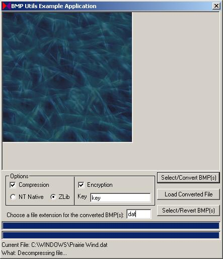



## Bitmap Utility Class \[2nd Update\]

### Description

*** Now supports Windows 9x with ZLib compression! You can find ZLib at http://www.zlib.net/. Be sure to put the zlib.dll file in a library folder. (For example, on Windows 2K/XP you would put zlib.dll in C:\WINDOWS\System32)

The example application has been updated. You are now presented with options to choose whether you want to use compression, what type of compression to use, or if you would like to use encryption.

----

This class module can be used to manipulate a bitmap in memory and blt that bitmap to a device context. (Picture Box, Form, DirectX [7] Surface, etc.)

The class provides some example functions for compression and encryption. However, you can compress, encrypt, decrypt, decompress a bitmap, and save the modified byte data however you want.

You can use this class as an example to create a custom graphics resource file. This code includes the entire source for the class module, and an example program to show you how to use the class.

The class module is fully commented. However, the example application is not so commented. Included with the download is a windows help file formatted similar to the MSDN help files. (*** The help file has not been updated with the ZLib compression option. However, the [De]CompressByteData_ZLib functions work the same as the [De]CompressByteData functions.)
 
### More Info
 
This class module contains a compression routine (found by Alex Ionescu) that requires Windows NT to function. The example project that comes with this class uses the compression routine to compress the graphics. Hence, the example application will not function properly on Windows 9x/ME. To run the example application on Windows 9x/ME, comment out the lines that use the CompressByteData and DecompressByteData methods of the class module.

             |
---                |---
**Submitted On**   |2006-03-29 10:46:50
**By**             |[Ron Zuber](https://github.com/Planet-Source-Code/PSCIndex/blob/master/ByAuthor/ron-zuber.md)
**Level**          |Intermediate
**User Rating**    |5.0 (80 globes from 16 users)
**Compatibility**  |VB 6\.0
**Category**       |[Graphics](https://github.com/Planet-Source-Code/PSCIndex/blob/master/ByCategory/graphics__1-46.md)
**World**          |[Visual Basic](https://github.com/Planet-Source-Code/PSCIndex/blob/master/ByWorld/visual-basic.md)
**Archive File**   |[Bitmap\_Uti1983883292006\.zip](https://github.com/Planet-Source-Code/ron-zuber-bitmap-utility-class-2nd-update__1-64749/archive/master.zip)

